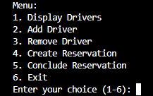

# Driver Management System

This is a simple Python-based driver management system that allows you to manage a list of drivers. You can add drivers, create reservations for them, conclude reservations, and display information about the drivers and their reservations.

## Features

- Add a new driver with a name.
- Create reservations for drivers.
- Conclude reservations for drivers.
- Display a list of drivers and their information.
- Keep track of the time spent on each reservation.

## Requirements

To run this driver management system, you need:

- Python 3.x installed on your system.
- The `datetime` module for handling date and time data.

## How to Use

1. Clone or download the repository to your local machine.

2. Make sure you have Python 3.x installed.

3. Run the `main.py` file to start the driver management system.

4. You can interact with the system via the command-line interface (CLI). Here are some available commands:

   - `add_driver`: Add a new driver. Provide a driver's name to add them to the system.
   - `create_reservation`: Create a reservation for a driver. Provide the driver's ID and reservation details.
   - `conclude_reservation`: Conclude a reservation for a driver. Provide the driver's ID.
   - `display_drivers`: Display the list of drivers and their information.

   Follow the prompts in the CLI to use these commands and manage drivers.

## File Structure

- `main.py`: The main script to run the driver management system.
- `utils.py`: Contains utility functions for reading JSON data and managing drivers.
- `Driver.py`: Defines the `Driver` class, which represents driver data.
- `drivers.json`: JSON file for storing driver data.

## Usage Examples

Here are some example usages of the system's features:

### Adding a Driver

```bash
$ python main.py
> add_driver
Enter driver's name: John Doe
```

### Creating a Reservation

```bash
$ python main.py
> create_reservation
Enter driver's ID: 0
Enter reservation details: Going to the airport
```

### Concluding a Reservation

```bash
$ python main.py
> conclude_reservation
Enter driver's ID: 0
```

### Displaying Drivers

```bash
$ python main.py
> display_drivers
```
## Screenshots



[](https://classroom.github.com/a/8TmUHw-g)
